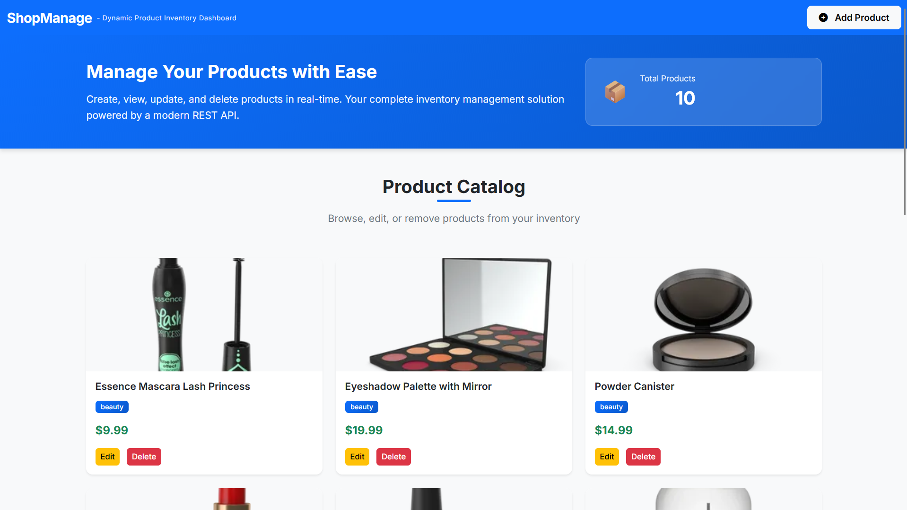
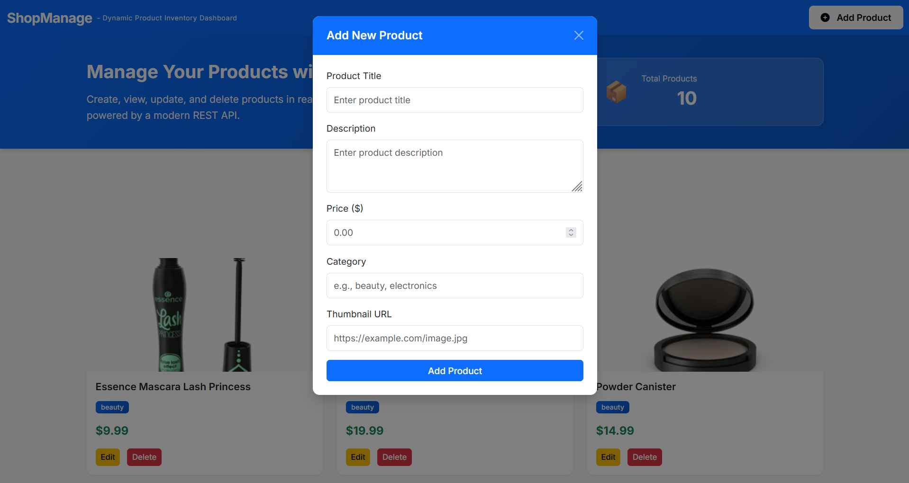
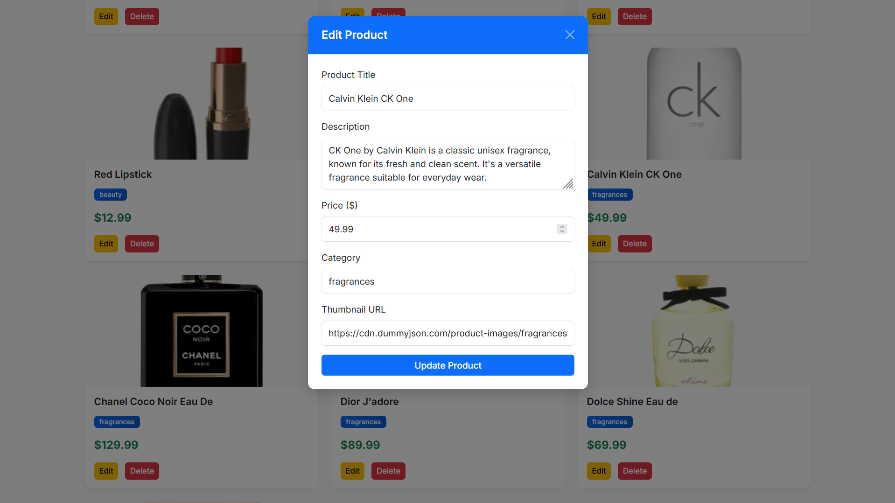
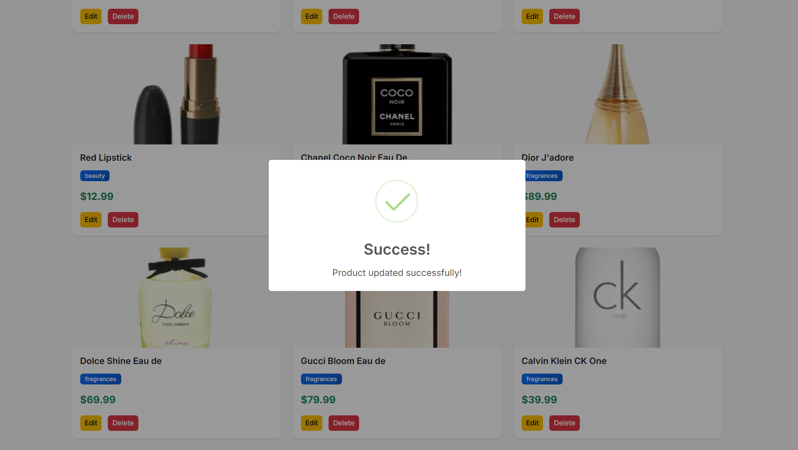

# ShopManage - Dynamic Product Inventory Dashboard

A modern, single-page application (SPA) for managing product inventory with full CRUD (Create, Read, Update, Delete) functionality. Built with Vanilla JavaScript, Bootstrap 5, and the DummyJSON API.


---

## 📋 Table of Contents
- [Features](#-features)
- [Technologies Used](#-technologies-used)
- [Project Structure](#-project-structure)
- [Getting Started](#-getting-started)
- [How It Works](#-how-it-works)
- [API Endpoints](#-api-endpoints)
- [Code Explanation](#-code-explanation)
- [Screenshots](#-screenshots)
- [Learning Objectives](#-learning-objectives)

---

## ✨ Features

### Core Functionality (CRUD Operations)
- ✅ **Create**: Add new products with title, description, price, category, and thumbnail
- ✅ **Read**: Fetch and display products from API with loading states
- ✅ **Update**: Edit existing product information with pre-filled forms
- ✅ **Delete**: Remove products with instant UI updates
- ✅ **Persist**: LocalStorage integration for offline data persistence

### User Experience
- 🎨 Modern, responsive design with Bootstrap 5
- 📱 Mobile-friendly interface
- 💫 Smooth hover animations on product cards
- 🔔 Beautiful SweetAlert2 notifications
- ⚡ Real-time product count tracking
- 🎯 Loading spinner during data fetch
- 🎭 Dynamic modal forms for Add/Edit modes
- 📝 Product descriptions displayed on cards

### Technical Features
- 🌐 Asynchronous API calls with `async/await`
- 🛡️ Comprehensive error handling with `.catch()` blocks
- 🔄 Single Page Application (no page refreshes)
- 📊 REST API integration
- 💾 Browser localStorage for data persistence
- 🎨 Custom CSS with CSS variables
- 🌈 Google Font integration (Inter)
- ✂️ Smart text truncation for descriptions
- 📏 Input validation with maxlength constraints

---

## 🛠️ Technologies Used

| Technology | Purpose | Version |
|------------|---------|---------|
| **HTML5** | Structure and semantic markup | - |
| **CSS3** | Custom styling and animations | - |
| **JavaScript** | Application logic (Vanilla JS) | ES6+ |
| **Bootstrap 5** | Responsive UI framework | 5.3.2 |
| **SweetAlert2** | Beautiful alert notifications | 11.x |
| **Font Awesome** | Icons | 6.5.1 |
| **Google Fonts** | Inter font family | - |
| **DummyJSON API** | Backend data source | - |

---

## 📁 Project Structure

```
ShopManage/
│
├── index.html          # Main HTML structure
├── style.css           # Custom styles and animations
├── app.js              # JavaScript application logic
└── README.md           # Project documentation
```

### File Breakdown

#### `index.html`
- Navigation bar with branding
- Hero section with app description
- Product container for dynamic cards
- Bootstrap modal for Add/Edit forms
- CDN links for libraries

#### `style.css`
- CSS variables for easy theming
- Custom card hover effects
- Hero section gradient styling
- Responsive design rules
- Modal and form enhancements

#### `app.js`
- Fetch products from API
- Display product cards dynamically
- Handle Add, Edit, Delete operations
- Form submission logic
- Error handling and user feedback

---

## 🚀 Getting Started

### Prerequisites
- A modern web browser (Chrome, Firefox, Edge, Safari)
- Internet connection (for CDN resources and API calls)
- Optional: Live Server extension (VS Code) or any local server

### Installation & Running

1. **Clone or Download** the project files
   ```bash
   git clone <your-repo-url>
   cd ShopManage
   ```

2. **Open with Live Server** (Recommended)
   - Right-click on `index.html`
   - Select "Open with Live Server"

   OR

3. **Open Directly in Browser**
   - Double-click `index.html`
   - The app will open in your default browser

4. **Start Using**
   - Products will automatically load on page load
   - Click "Add Product" to create new items
   - Click "Edit" to modify existing products
   - Click "Delete" to remove products

---

## 🔍 How It Works

### Application Flow

```
Page Load
    ↓
Check LocalStorage
    ↓
├─ Has Data? → Load from LocalStorage (Offline Mode)
│
└─ No Data? → Fetch from API (First Time) → Save to LocalStorage
    ↓
Display Product Cards
    ↓
User Interactions:
    │
    ├── Click "Add Product" → Open Modal → Submit Form → POST to API → Save to LocalStorage → Display New Card
    │
    ├── Click "Edit" → Load from LocalStorage → Pre-fill Modal → Submit → PUT to API → Update LocalStorage → Update Card
    │
    └── Click "Delete" → DELETE to API → Remove from LocalStorage → Remove Card from UI
```

### Key Functions

1. **`getLocalProducts()` & `saveLocalProducts()`**
   - Helper functions for localStorage management
   - Persist data across browser sessions

2. **`fetchProducts()`**
   - Checks localStorage first (faster, offline support)
   - Falls back to API on first load
   - Shows loading spinner
   - Displays products or error message

2. **`displayProduct(product)`**
   - Creates Bootstrap card for each product
   - Displays title, description (truncated to 80 chars), category, price
   - Adds product ID as data attribute
   - Appends card to container

3. **`addProduct()`**
   - Sends POST request with product data
   - Generates unique ID and saves to localStorage
   - Displays new product card
   - Shows success notification

4. **`editProduct(productId)`**
   - Loads product from localStorage (not API)
   - Pre-fills modal form
   - Changes modal to "Edit" mode

5. **`updateProduct(productId)`**
   - Sends PUT request with updated data
   - Updates localStorage
   - Replaces old card with new one
   - Shows success notification

6. **`deleteProduct(productId)`**
   - Sends DELETE request
   - Removes from localStorage
   - Removes card from DOM
   - Shows success notification

7. **`updateProductCount()`**
   - Counts displayed products
   - Updates hero section counter

---

## 🌐 API Endpoints

Base URL: `https://dummyjson.com`

| Method | Endpoint | Purpose | Request Body |
|--------|----------|---------|--------------|
| GET | `/products?limit=10` | Fetch 10 products | None |
| GET | `/products/{id}` | Fetch single product | None |
| POST | `/products/add` | Add new product | JSON object |
| PUT | `/products/{id}` | Update product | JSON object |
| DELETE | `/products/{id}` | Delete product | None |

### Example Request Body (POST/PUT)
```json
{
  "title": "Amazing Product",
  "description": "This is a great product",
  "price": 99.99,
  "category": "electronics",
  "thumbnail": "https://example.com/image.jpg"
}
```

---

## 💡 Code Explanation

### LocalStorage for Data Persistence
```javascript
// Save products to localStorage
function saveLocalProducts(products) {
    localStorage.setItem('shopManageProducts', JSON.stringify(products));
    localProducts = products;
}

// Load products from localStorage
function getLocalProducts() {
    const stored = localStorage.getItem('shopManageProducts');
    return stored ? JSON.parse(stored) : null;
}
```

### Async/Await Pattern
```javascript
async function fetchProducts() {
    try {
        const response = await fetch('URL');
        const data = await response.json();
        // Process data
    } catch (error) {
        console.error('Error:', error);
    }
}
```

### CSS Variables for Easy Theming
```css
:root {
    --primary-color: #0d6efd;
    --hero-bg: linear-gradient(135deg, #0d6efd 0%, #0a58ca 100%);
}
```

### Data Attribute for Element Selection
```javascript
// Add ID to card
productCard.setAttribute('data-product-id', product.id);

// Find card by ID
const card = document.querySelector(`[data-product-id="${productId}"]`);
```

### Global Variable for Edit Mode
```javascript
let editingProductId = null;  // null = Add mode, value = Edit mode
```

---

## 📸 Screenshots

### Main Dashboard


### Add Product Modal


### Edit Product


### SweetAlert Notifications


---

## 🎓 Learning Objectives

This project demonstrates understanding of:

1. **JavaScript Fundamentals**
   - Variables, functions, and scope
   - Async/await and Promises
   - DOM manipulation
   - Event handling
   - Array methods (forEach, find, filter, map)
   - LocalStorage API

2. **API Integration**
   - REST API concepts (GET, POST, PUT, DELETE)
   - Fetch API
   - JSON parsing
   - Error handling
   - Response status validation

3. **Modern Web Development**
   - Single Page Application (SPA) architecture
   - Data persistence with localStorage
   - Offline-first approach
   - Responsive design
   - CSS animations and transitions
   - Component-based thinking

4. **Best Practices**
   - Code organization and comments
   - Comprehensive error handling
   - User feedback and validation
   - Semantic HTML
   - CSS variables for maintainability
   - Input sanitization (maxlength)

---

## 🤝 Contributing

This is a student project for learning purposes. Feel free to:
- Fork the repository
- Submit issues
- Suggest improvements
- Use it as a learning resource

---

## 📝 License

This project is open source and available for educational purposes.

---

## 👨‍💻 Author

**Maalik Hassan**  
Aspiring Software Engineer  
ICET-ICD119

---

## 🙏 Acknowledgments

- [DummyJSON](https://dummyjson.com) for the free REST API
- [Bootstrap](https://getbootstrap.com) for the UI framework
- [SweetAlert2](https://sweetalert2.github.io) for beautiful alerts
- [Font Awesome](https://fontawesome.com) for icons
- [Google Fonts](https://fonts.google.com) for the Inter font

---

## 📞 Support

If you have questions or need help understanding the code:
1. Review the comments in each file
2. Check the API documentation at [dummyjson.com](https://dummyjson.com)
3. Refer to this README

---

**Built with ❤️ for learning and growth**
